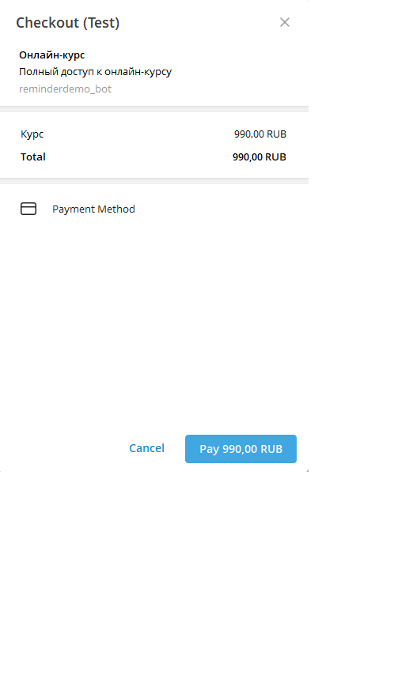

# 💳 Telegram Bot для продажи курса с оплатой через ЮKassa

Telegram-бот на **aiogram 3.x** для продажи онлайн-курса с интеграцией платежей ЮKassa. Построен на основе **модульной архитектуры** с использованием **объектно-ориентированного программирования**.

## 🚀 Быстрый старт

1. **Установите зависимости:**
```bash
pip install -r requirements.txt
```

2. **Получите токены от клиента:**
   - Клиент должен создать бота через @BotFather и подключить платежи
   - См. инструкцию для клиента в файле **`CLIENT_SETUP.md`**
   - Получите от клиента: `BOT_TOKEN`, `PROVIDER_TOKEN`, `CHANNEL_ID`

3. **Создайте файл `.env`** на основе `.env.example` с полученными данными:
```env
# Telegram Bot Configuration
BOT_TOKEN=токен_от_клиента

# Payment Configuration
PROVIDER_TOKEN=токен_провайдера_от_клиента
COURSE_PRICE=990

# Channel Configuration
CHANNEL_ID=ID_канала_от_клиента

# Database Configuration
DB_PATH=bot.db

# Logging Configuration
LOG_LEVEL=INFO
LOG_FILE=bot.log
```

4. **Запустите бота:**
```bash
python main.py
```

## 📋 Настройка

### Получение токенов

**Для разработчика:** Токены получает клиент и передает вам.

**Клиент должен:**
1. Создать бота через @BotFather → получить `BOT_TOKEN`
2. Подключить платежи через @BotFather → получить `PROVIDER_TOKEN`
3. Создать канал и добавить бота как администратора → получить `CHANNEL_ID`

Подробная инструкция для клиента в файле **`CLIENT_SETUP.md`**

### Настройка канала

1. Создайте приватный канал в Telegram
2. Добавьте бота в канал как администратора
3. Укажите `CHANNEL_ID` в `.env` (например: `@test_channel` или `-1001234567890`)

## 🧪 Тестирование платежей

Для тестирования используйте тестовые карты ЮKassa:

- **Номер карты**: `4111 1111 1111 1111`
- **CVV**: `123`
- **Срок действия**: `12/25`

## 📸 Демонстрация

### Главное меню

*Главное меню с кнопками для пробного урока и покупки курса*

### Окно оплаты

*Окно оплаты через Telegram Payments (ЮKassa)*

### Успешная оплата

*Сообщение об успешной оплате с ссылкой для доступа к курсу*

## 📁 Структура проекта

```
CoursePaymentBot/
├── src/                    # Исходный код (модульная архитектура)
│   ├── __init__.py
│   ├── config.py          # Класс конфигурации (ООП)
│   ├── bot/               # Telegram bot логика
│   │   ├── __init__.py
│   │   └── handlers.py   # Обработчики команд
│   ├── database/          # Работа с БД
│   │   ├── __init__.py
│   │   └── models.py      # Класс Database (ООП)
│   ├── services/          # Бизнес-логика
│   │   ├── __init__.py
│   │   ├── payment_service.py    # Сервис платежей (ООП)
│   │   └── user_service.py       # Сервис пользователей (ООП)
│   └── utils/             # Утилиты
│       ├── __init__.py
│       ├── keyboards.py   # Inline клавиатуры
│       └── material_loader.py  # Загрузка материалов
├── main.py                 # Точка входа
├── materials/              # Материалы курса
│   └── trial_lesson.md     # Пробный урок
├── .env.example            # Пример конфигурации
├── requirements.txt
└── README.md
```

### 🏗️ Архитектура

Проект использует **модульную архитектуру** с разделением на слои:

- **Config** (`src/config.py`) - Управление конфигурацией через ООП класс
- **Database** (`src/database/models.py`) - Класс для работы с SQLite
- **PaymentService** (`src/services/payment_service.py`) - Сервис обработки платежей
- **UserService** (`src/services/user_service.py`) - Сервис управления пользователями
- **BotHandlers** (`src/bot/handlers.py`) - Обработчики команд Telegram
- **MaterialLoader** (`src/utils/material_loader.py`) - Утилита для загрузки материалов

Такой подход обеспечивает:
- ✅ Разделение ответственности (SRP)
- ✅ Легкость тестирования
- ✅ Простота расширения функционала
- ✅ Читаемость и поддержку кода

## 🎯 Функционал

- `/start` - Приветствие и главное меню
- `/trial` - Получить пробный урок
- Покупка курса через Telegram Payments (ЮKassa)
- Автоматическое добавление в канал после оплаты
- Проверка статуса оплаты при повторном входе

## 🔧 Технологии

- **aiogram 3.x** - Асинхронный фреймворк для Telegram Bot API
- **SQLite** (aiosqlite) - Асинхронная база данных для хранения пользователей
- **Pydantic Settings** - Валидация настроек из `.env`
- **ЮKassa** - Платежный провайдер
- **ООП** - Объектно-ориентированное программирование для чистой архитектуры

## 📝 Логирование

Логи сохраняются в файл `bot.log` и выводятся в консоль.

## ⚠️ Важно

- Бот должен быть администратором канала
- Для продакшена используйте реальный токен ЮKassa (не sandbox)
- Регулярно делайте резервные копии базы данных
- Файл `.env` с токенами должен быть исключен из Git (уже добавлен в `.gitignore`)

## 🚀 Переход на реальные платежи

Для перехода с тестовых на реальные платежи см. файл **`PRODUCTION_SETUP.md`** с подробными инструкциями.

Кратко:
1. Пройдите верификацию в ЮKassa
2. Подключите реальный провайдер через @BotFather
3. Обновите `PROVIDER_TOKEN` в `.env` на реальный токен (формат: `SHOP_ID:LIVE:SECRET_KEY`)
4. Перезапустите бота

