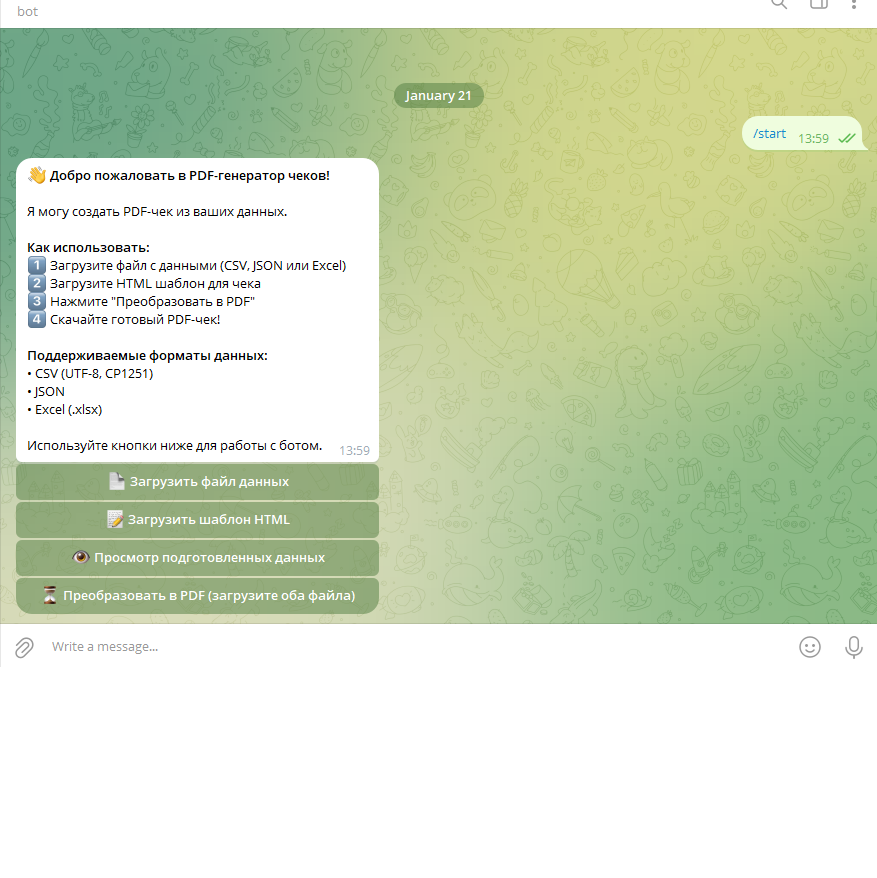
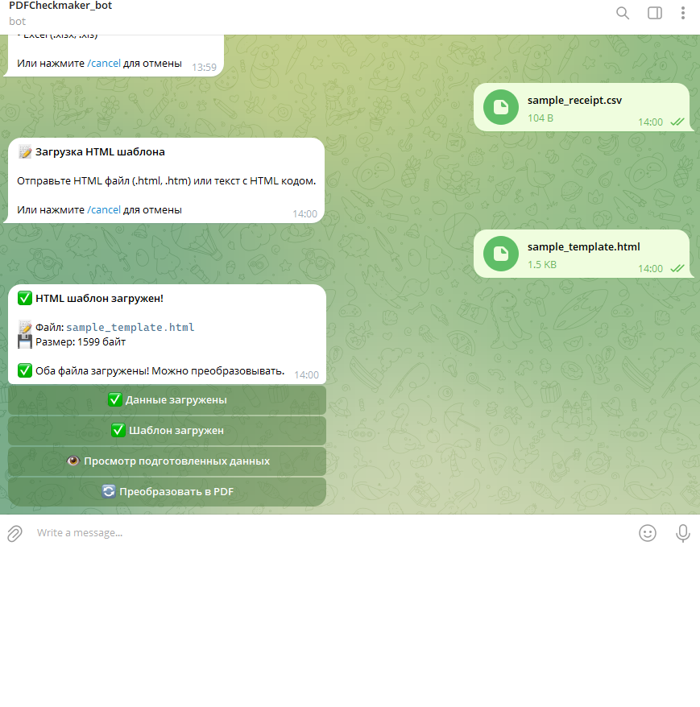
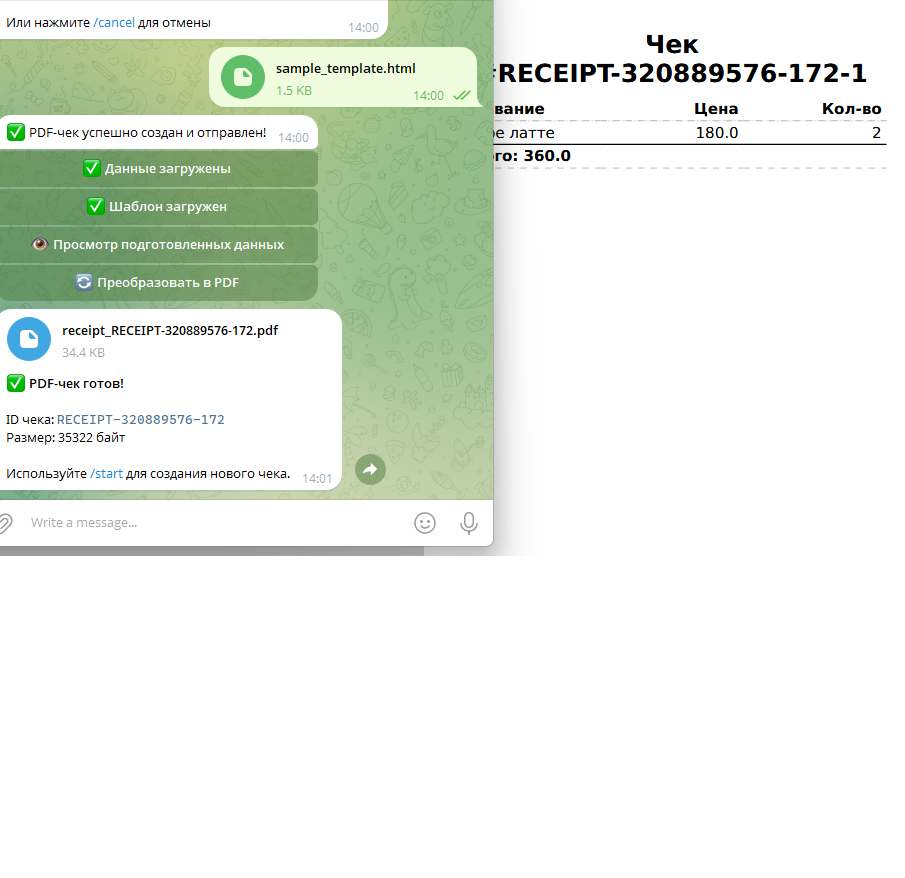

# 🧾 Bot-PDFChekmaker

Telegram бот на **aiogram 3.x** для генерации PDF‑чеков из файлов данных (CSV/JSON/Excel) с использованием HTML‑шаблонов. Построен на основе **модульной архитектуры** с использованием **объектно-ориентированного программирования**.

## 🚀 Возможности

- ✅ **Поддержка CSV, JSON и Excel (.xlsx) файлов**
- ✅ **Автоматическое определение типа файла**
- ✅ **Поддержка различных кодировок** (UTF-8, CP1251)
- ✅ **Рендеринг HTML шаблонов с Jinja2**
- ✅ **Автоматическая защита верстки** (CSS fallback)
- ✅ **Обрезка длинных текстов**
- ✅ **Формат чека A6** с настраиваемыми отступами
- ✅ **Интуитивный интерфейс Telegram бота**

## Установка

### Требования

- Python >= 3.8
- Telegram Bot Token (получить у [@BotFather](https://t.me/BotFather))

### 1. Клонирование репозитория

```bash
git clone https://github.com/yourusername/Bot-PDFChekmaker.git
cd Bot-PDFChekmaker
```

### 2. Создание виртуального окружения

#### Windows

```powershell
# Используйте стандартный Python (не MSYS2)
py -m venv venv

# Активация окружения
.\venv\Scripts\activate
```

#### Linux / macOS

```bash
python3 -m venv venv

# Активация окружения
source venv/bin/activate
```

### 3. Установка зависимостей

```bash
pip install --upgrade pip
pip install -r requirements.txt
```

### 4. Настройка переменных окружения

Создайте файл `.env` в корне проекта на основе `.env.example`:

```bash
# Windows
copy .env.example .env

# Linux / macOS
cp .env.example .env
```

Отредактируйте `.env` файл и укажите:

```env
# Telegram Bot Configuration
BOT_TOKEN=your_bot_token_here

# Admin Configuration (optional – если пусто, бот доступен всем)
ADMIN_ID=

# Logging
LOG_LEVEL=INFO
LOG_FILE=bot.log
```

**Как получить токен бота:**
1. Откройте Telegram и найдите [@BotFather](https://t.me/BotFather)
2. Отправьте команду `/newbot`
3. Следуйте инструкциям для создания бота
4. Скопируйте полученный токен в файл `.env`

**Как получить свой ID (для ADMIN_ID):**
1. Откройте Telegram и найдите [@userinfobot](https://t.me/userinfobot)
2. Отправьте команду `/start`
3. Скопируйте ваш ID в файл `.env`

> **Примечание:** Если `ADMIN_ID` не указан, бот будет доступен всем пользователям.

### 5. Дополнительные требования (только для Windows)

WeasyPrint требует GTK+ runtime библиотеки на Windows для генерации PDF.

**Вариант 1: Через MSYS2 (рекомендуется)**
1. Скачайте и установите [MSYS2](https://www.msys2.org/)
2. Откройте MSYS2 terminal и выполните:
   ```bash
   pacman -S mingw-w64-x86_64-gtk3
   ```
3. Добавьте путь к GTK+ в переменную окружения PATH:
   ```
   C:\msys64\mingw64\bin
   ```

**Вариант 2: Прямая установка GTK+**
1. Скачайте GTK+ для Windows с [официального сайта](https://www.gtk.org/docs/installations/windows/)
2. Распакуйте и добавьте `bin` директорию в PATH

> **Примечание для Linux/macOS:** GTK+ обычно уже установлен или устанавливается автоматически через пакетный менеджер.

## Запуск бота

### Windows

```powershell
# Активация виртуального окружения (если еще не активировано)
.\venv\Scripts\activate

# Запуск бота
python bot.py
```

### Linux / macOS

```bash
# Активация виртуального окружения (если еще не активировано)
source venv/bin/activate

# Запуск бота
python bot.py
```

Бот запустится и начнет обрабатывать сообщения в Telegram. Для остановки нажмите `Ctrl+C`.

## Использование бота

1. Найдите вашего бота в Telegram
2. Отправьте команду `/start`
3. Следуйте инструкциям в боте:
   - Загрузите файл с данными (CSV, JSON или Excel)
   - Загрузите HTML шаблон
   - Нажмите "Преобразовать в PDF"
   - Получите готовый PDF-чек!

### Поддерживаемые форматы данных

#### CSV
- Кодировки: UTF-8, CP1251, Windows-1251
- Автоматическое определение кодировки
- Первая строка как заголовки

#### JSON
- UTF-8 кодировка
- Поддержка массивов объектов и одиночных объектов

#### Excel (.xlsx)
- Только формат .xlsx
- Первая строка как заголовки

## 📸 Демонстрация

### Главное меню

*Главное меню с кнопками для загрузки файлов и генерации PDF*

### Загрузка файлов

*Экран после загрузки CSV и HTML шаблона с активной кнопкой генерации*

### Готовый PDF-чек

*Сообщение с готовым PDF-чеком для скачивания*

## Программное использование

### Базовый пример

```python
from src.pdf_generator import generate_receipt_pdf

# Читаем файлы
with open("data.csv", "rb") as f:
    csv_bytes = f.read()

with open("template.html", "rb") as f:
    html_bytes = f.read()

# Генерируем PDF
pdf_bytes, error = generate_receipt_pdf(
    data_bytes=csv_bytes,
    html_template_bytes=html_bytes,
    receipt_id="RECEIPT-001",
    file_type=None  # Автоопределение
)

if error:
    print(f"Ошибка: {error}")
else:
    # Сохраняем PDF
    with open("receipt.pdf", "wb") as f:
        f.write(pdf_bytes)
```

## HTML Шаблоны

Шаблоны используют Jinja2 синтаксис. Доступные переменные:

- `items` - список товаров из файла данных
- `receipt_id` - ID чека
- `total` - общая сумма (автоматически вычисляется)

### Готовые примеры

В папке `examples/` уже есть минимальный набор файлов:

- `examples/sample_receipt.csv` — пример данных (несколько позиций чека)
- `examples/sample_template.html` — готовый HTML‑шаблон под формат A6

Их можно сразу загрузить в бота, чтобы быстро получить красивый PDF.

### Пример шаблона

```html
<!DOCTYPE html>
<html>
<head>
    <style>
        @page { size: A6; margin: 5mm; }
        table { table-layout: fixed; width: 100%; }
    </style>
</head>
<body>
    <h2>Чек #{{ receipt_id }}</h2>
    <table>
        <thead>
            <tr>
                <th>Название</th>
                <th>Цена</th>
                <th>Количество</th>
            </tr>
        </thead>
        <tbody>
            
            <tr>
                <td>{{ item.name }}</td>
                <td>{{ item.price }}</td>
                <td>{{ item.quantity }}</td>
            </tr>
            
        </tbody>
    </table>
    <p><strong>Итого: {{ total }}</strong></p>
</body>
</html>
```

### Автоматическая защита верстки

Если в шаблоне отсутствуют CSS правила, они будут добавлены автоматически:

- `@page { size: A6; margin: 5mm; }` - формат страницы
- `table { table-layout: fixed; width: 100%; }` - фиксированная таблица

Длинные тексты автоматически обрезаются до 60 символов.

## 📁 Структура проекта

```
pdf-checkmaker-bot/
├── src/
│   ├── __init__.py
│   ├── config.py              # Класс Config (Pydantic Settings)
│   ├── bot/
│   │   ├── __init__.py
│   │   └── handlers.py        # Все Telegram-обработчики и FSM
│   ├── pdf_generator.py       # Основная функция generate_receipt_pdf()
│   ├── file_parser.py         # Парсинг CSV/JSON/Excel
│   ├── template_renderer.py   # Рендеринг Jinja2 шаблонов
│   └── utils.py               # Утилиты (truncate_text, safe_float, safe_str)
├── tests/
│   ├── test_pdf_generator.py  # Pytest тесты
│   └── test_files/            # Тестовые файлы
├── bot.py                     # Точка входа, инициализация бота/DP
├── requirements.txt
├── pyproject.toml
├── README.md
├── .gitignore
└── .env.example               # Пример файла с переменными окружения
```

### 🏗 Архитектура

- **Config** (`src/config.py`) — загрузка и валидация настроек через `pydantic-settings`
- **Bot handlers** (`src/bot/handlers.py`) — все обработчики команд, callback’ов и FSM‑состояний
- **PDF генератор** (`src/pdf_generator.py`) — сборка PDF через WeasyPrint и pypdf
- **Парсер файлов** (`src/file_parser.py`) — определение типа файла и парсинг CSV/JSON/Excel
- **Рендеринг шаблонов** (`src/template_renderer.py`) — Jinja2 + защита верстки
- **Утилиты** (`src/utils.py`) — безопасные конвертации и обрезка текста

Такое разделение упрощает поддержку, тестирование и демонстрацию проекта в портфолио.

## Тестирование

```bash
pytest tests/
```

Запуск с покрытием:

```bash
pytest tests/ --cov=src --cov-report=html
```

## API Документация

### `generate_receipt_pdf()`

```python
def generate_receipt_pdf(
    data_bytes: bytes,
    html_template_bytes: bytes,
    receipt_id: str = None,
    file_type: str = None
) -> tuple[bytes | None, str | None]:
```

**Параметры:**

- `data_bytes` - Байты файла с данными (CSV/JSON/Excel)
- `html_template_bytes` - Байты HTML шаблона
- `receipt_id` - ID чека (опционально)
- `file_type` - Тип файла ("csv", "json", "xlsx") или None для автоопределения

**Возвращает:**

- `tuple[pdf_bytes, error_msg]` - Байты PDF и сообщение об ошибке (если есть)

## Требования

- Python >= 3.8
- pandas >= 2.0.0
- jinja2 >= 3.1.0
- weasyprint >= 60.0
- openpyxl >= 3.1.0
- aiogram >= 3.0.0
- python-dotenv >= 1.0.0
- pydantic-settings >= 2.5.2

## Развертывание

### Windows (Production)

Для запуска бота в фоновом режиме на Windows можно использовать:

1. **Task Scheduler** - создайте задачу для запуска `bot.py`
2. **NSSM (Non-Sucking Service Manager)** - запуск как Windows сервис
3. **Screen/Tmux** (если установлен WSL) - для управления сессиями

### Linux (Production)

Для запуска бота как системный сервис на Linux:

1. Создайте systemd service файл `/etc/systemd/system/bot-pdfchekmaker.service`:

```ini
[Unit]
Description=PDF Chekmaker Telegram Bot
After=network.target

[Service]
Type=simple
User=your_user
WorkingDirectory=/path/to/Bot-PDFChekmaker
Environment="PATH=/path/to/Bot-PDFChekmaker/venv/bin"
ExecStart=/path/to/Bot-PDFChekmaker/venv/bin/python bot.py
Restart=always

[Install]
WantedBy=multi-user.target
```

2. Активируйте и запустите сервис:

```bash
sudo systemctl enable bot-pdfchekmaker
sudo systemctl start bot-pdfchekmaker
sudo systemctl status bot-pdfchekmaker
```

## Устранение неполадок

### Windows: Ошибка "GTK+ not found"

Установите GTK+ согласно инструкциям в разделе "Дополнительные требования (только для Windows)".

### Linux: Ошибка "libgtk-3.so.0: cannot open shared object file"

Установите GTK+ через пакетный менеджер:

```bash
# Ubuntu/Debian
sudo apt-get install libgtk-3-0

# Fedora/CentOS
sudo dnf install gtk3
```

### Ошибка "BOT_TOKEN не найден в .env файле"

Убедитесь, что:
1. Файл `.env` существует в корне проекта
2. В файле указан `BOT_TOKEN=your_token`
3. Нет лишних пробелов вокруг знака `=`

## Лицензия

MIT

## Автор

Your Name

## Вклад в проект

Пул-реквесты приветствуются! Для крупных изменений сначала откройте issue для обсуждения.
