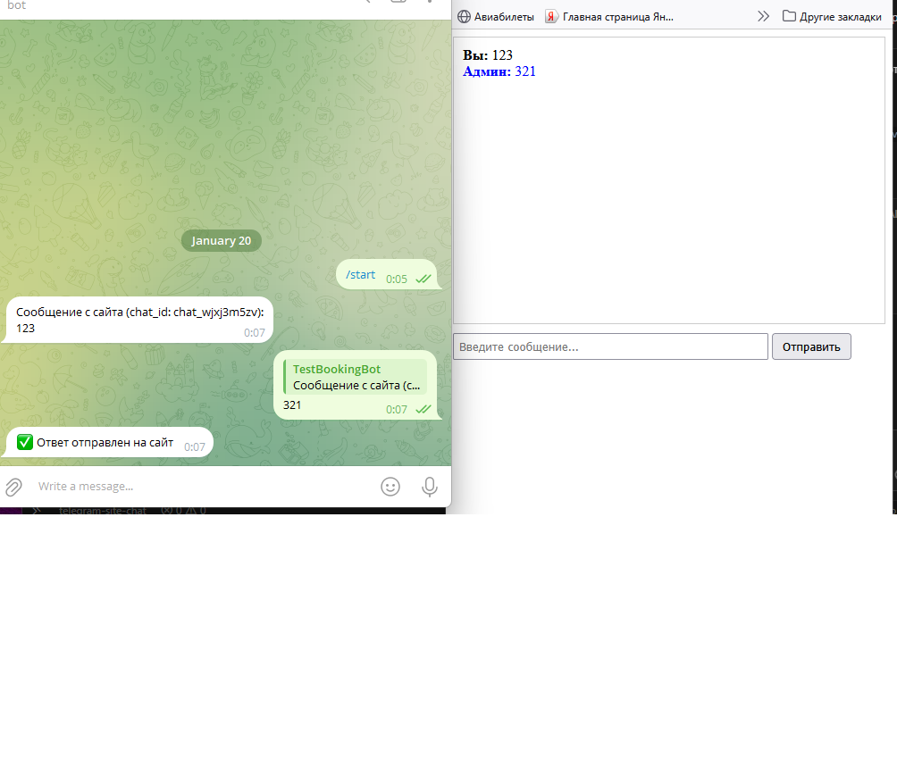

# 🤖 Telegram Site Chat

Система чата между посетителями сайта и администратором через Telegram бота.

## 📋 Описание проекта

Этот проект позволяет организовать чат между посетителями вашего сайта и администратором через Telegram. Сообщения с сайта отправляются администратору в Telegram, а ответы администратора доставляются обратно на сайт.

## 🏗️ Архитектура

Проект использует **модульную архитектуру** с разделением на слои:

- **Config** (`src/config.py`) - Управление конфигурацией через ООП класс
- **BotHandlers** (`src/bot/handlers.py`) - Обработчики команд Telegram
- **ServerRoutes** (`src/server/routes.py`) - Маршруты Flask сервера
- **MessageService** (`src/services/message_service.py`) - Сервис отправки сообщений
- **ReplyService** (`src/services/reply_service.py`) - Сервис управления ответами
- **ChatIdParser** (`src/utils/parsers.py`) - Утилита для парсинга chat_id

Такой подход обеспечивает:
- ✅ Чистую архитектуру
- ✅ Разделение ответственности
- ✅ Легкость тестирования
- ✅ Масштабируемость

## 📁 Структура проекта

```
telegram-site-chat/
├── src/                    # Исходный код (модульная архитектура)
│   ├── __init__.py
│   ├── config.py          # Класс конфигурации (ООП)
│   ├── bot/               # Telegram bot логика
│   │   ├── __init__.py
│   │   └── handlers.py   # Обработчики команд
│   ├── server/            # Flask сервер
│   │   ├── __init__.py
│   │   └── routes.py     # Маршруты API
│   ├── services/          # Бизнес-логика
│   │   ├── __init__.py
│   │   ├── message_service.py  # Сервис отправки сообщений (ООП)
│   │   └── reply_service.py    # Сервис управления ответами (ООП)
│   └── utils/             # Утилиты
│       ├── __init__.py
│       └── parsers.py     # Парсинг chat_id
├── main_bot.py            # Точка входа для бота
├── main_server.py         # Точка входа для Flask сервера
├── index.html            # Веб-интерфейс чата
├── .env.example          # Пример конфигурации
├── requirements.txt
├── screenshots/          # Скриншоты работы
│   ├── демо1.png
│   └── демо2.png
└── README.md
```

## 🛠️ Требования

- Python 3.8+
- Telegram Bot Token (получите у [@BotFather](https://t.me/BotFather))
- Chat ID администратора (можно узнать через [@userinfobot](https://t.me/userinfobot))

## 📦 Установка

1. Клонируйте репозиторий или скачайте файлы проекта

2. Установите зависимости:
```bash
pip install -r requirements.txt
```

3. Создайте файл `.env` на основе `.env.example`:
```bash
cp .env.example .env
```

4. Заполните `.env`:
```env
# Telegram Bot
BOT_TOKEN=your_bot_token_here

# Admin Chat ID
ADMIN_CHAT_ID=your_admin_chat_id_here

# Flask Server URL (опционально)
FLASK_URL=http://localhost:5000
```

**Как получить BOT_TOKEN:**
- Откройте Telegram и найдите [@BotFather](https://t.me/BotFather)
- Отправьте команду `/newbot`
- Следуйте инструкциям и получите токен

**Как получить ADMIN_CHAT_ID:**
- Откройте Telegram и найдите [@userinfobot](https://t.me/userinfobot)
- Отправьте любое сообщение боту
- Скопируйте ваш Chat ID (число, например: 123456789)

## 🚀 Запуск

### 1. Запустите Flask сервер

В одном терминале:
```bash
python main_server.py
```

Сервер запустится на `http://localhost:5000`

### 2. Запустите Telegram бота

В другом терминале:
```bash
python main_bot.py
```

### 3. Откройте сайт

Откройте файл `index.html` в браузере (можно использовать любой веб-сервер, например Live Server в VS Code).

## 📸 Демонстрация

### Веб-интерфейс чата


### Сообщение администратору в Telegram


### Ответ администратора на сайте


## 💡 Как использовать

1. **На сайте:** Посетитель вводит сообщение в форму чата и отправляет его
2. **В Telegram:** Администратор получает сообщение с указанием `chat_id`
3. **Ответ администратора:** Администратор отвечает на сообщение в Telegram (reply)
4. **На сайте:** Ответ появляется в чате автоматически через несколько секунд

## 🔌 API Endpoints

### POST /send_message
Отправка сообщения с сайта администратору
```json
{
  "chat_id": "site_chat_id",
  "message": "Текст сообщения"
}
```

### POST /admin_reply
Принимает ответы от бота (вызывается автоматически ботом)
```json
{
  "site_chat_id": "site_chat_id",
  "message": "Ответ администратора"
}
```

### GET /get_replies
Получение ответов администратора для конкретного сайт-чата
```
GET /get_replies?chat_id=site_chat_id
```

## ⚠️ Важные замечания

- Убедитесь, что оба сервера (Flask и бот) запущены одновременно
- Для продакшена рекомендуется использовать веб-сервер (nginx, Apache) и запускать Flask через gunicorn или uwsgi
- Для бота рекомендуется использовать webhook вместо polling в продакшене
- Убедитесь, что файл `.env` находится в корне проекта и содержит правильные значения

## 🔧 Технологии

- **aiogram 3.x** - Асинхронный фреймворк для Telegram Bot API
- **Flask** - Веб-фреймворк для API
- **Pydantic Settings** - Валидация настроек из `.env`
- **SQLite** - База данных (если потребуется в будущем)

## 🐛 Возможные проблемы

1. **"Flask сервер недоступен"** - Убедитесь, что `main_server.py` запущен
2. **"Не удалось отправить"** - Проверьте правильность `BOT_TOKEN` в `.env`
3. **Ответы не приходят на сайт** - Проверьте, что бот запущен и отвечает на сообщения через reply
4. **Ошибка импорта модулей** - Убедитесь, что вы запускаете скрипты из корня проекта

## 📝 Лицензия

MIT
